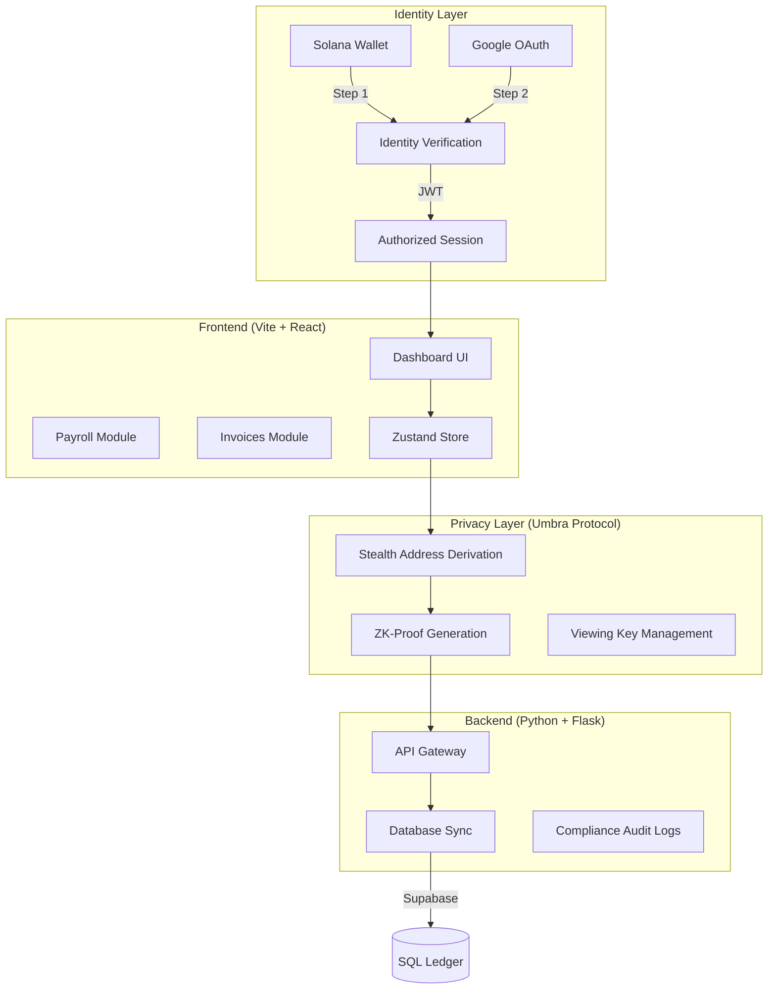

# 🛡️ StealthPay: The Private Business Finance OS

StealthPay is a premium, production-grade financial operating system built for the Solana ecosystem. It solves the critical challenge of **on-chain privacy** for businesses, allowing them to manage payroll, vendor payments, and invoicing with absolute confidentiality while maintaining institutional-grade compliance.

By leveraging the **Umbra Protocol SDK**, StealthPay ensures that sensitive financial data—such as employee salaries and corporate treasury movements—remains invisible to public blockchain observers.

---

## 🚀 Why StealthPay? (Benefits)

In a standard transparent ledger, every business transaction is a public record. StealthPay changes this by providing:

*   **Absolute Payroll Privacy**: Employees can receive their salaries without their colleagues or competitors knowing their compensation details.
*   **Confidential Vendor Management**: Protect your supply chain and pricing by masking payments to vendors and partners.
*   **Institutional Compliance**: Every private transaction generates a unique **Viewing Key**. Share this key with auditors or tax authorities to prove payment without revealing your entire wallet history.
*   **Premium User Experience**: A high-fidelity "Spatial UI" built with Next.js and Framer Motion, providing a seamless bridge between Web2 ease-of-use and Web3 power.
*   **Multi-Factor Security**: Mandates a 2-step authentication flow (Solana Wallet + Google OAuth) to ensure only authorized personnel can access the treasury.

---

## 🏗️ System Architecture

StealthPay utilizes a high-performance full-stack architecture with a specialized privacy layer.

---

## 📂 Project Structure

### **Backend (`/backend`)**
- `app/__init__.py`: Application factory and blueprint registration.
- `app/api/`: RESTful endpoints for authentication, payroll, and invoicing.
- `app/blockchain/`: Solana interaction logic and RPC management.
- `app/models/`: SQLAlchemy database models for local synchronization.
- `app/services/`: Business logic for stealth address generation and Umbra integration.
- `app/utils/`: Security utilities, JWT handling, and identity verification helpers.

### **Frontend (`/frontend`)**
- `src/components/`: Reusable UI components (Bento grids, glassmorphism elements).
- `src/hooks/`: Custom React hooks for wallet state and API fetching.
- `src/lib/`: Core libraries (Umbra SDK, Supabase client).
- `src/pages/`: Main application views (Dashboard, Compliance Terminal, Auth).
- `src/store/`: Zustand state management for global application state.
- `src/types/`: TypeScript interfaces for unified data structures.

---

## 🛠️ How to Use StealthPay

### 1. Secure Onboarding
Connect your corporate Solana wallet (Phantom/Solflare) and complete the **Google Workspace verification**. This dual-link ensures that the wallet owner is an authorized member of your organization.

### 2. Stealth Setup
When you add an employee or vendor, StealthPay automatically fetches their public keys and prepares a **Stealth Profile**. This profile is used to derive one-time addresses for every payment you send them.

### 3. Executing Payroll
Upload your payroll CSV or select employees from the dashboard. StealthPay will:
1.  Derive unique stealth addresses for each recipient.
2.  Encrypt payment metadata.
3.  Execute a single-click batch transaction from your treasury.

### 4. Invoicing & Billing
Create encrypted invoices for your clients. When a client pays a StealthPay invoice, the funds are routed through the Umbra protocol, ensuring that your business's total revenue remains private from on-chain scrapers.

### 5. Compliance Audit
Need to prove a payment to the IRS or an auditor? Navigate to the **Compliance Terminal**, select the transaction, and generate a temporary **Viewing Key (VK)**. The auditor can use this key to verify the transaction details on the blockchain without accessing your private keys.

---

## 🔐 Core Privacy Mechanism: Stealth Addresses

StealthPay does not just "hide" transactions; it makes them **unlinkable**.

1.  **Generation**: For every transaction, the sender generates a new, one-time address (the "Stealth Address") using the recipient's public spend and view keys.
2.  **Transmission**: Funds are sent to this address. To an observer, it looks like a random, new wallet is receiving funds.
3.  **Discovery**: The recipient's wallet "scans" the blockchain using their private view key to identify transactions belonging to them.
4.  **Claiming**: Only the recipient can generate the private key required to move funds out of the stealth address.

---

## 📊 Feature Comparison

| Feature | Standard Wallets | StealthPay OS |
| :--- | :---: | :---: |
| **Transaction Visibility** | Public (Explorer) | Encrypted (Stealth) |
| **Identity Linkage** | Wallet Address | Multi-Factor (Google + Wallet) |
| **Payroll Privacy** | None (All salaries public) | Absolute (Private Transfers) |
| **Invoicing** | Manual Tracking | Automated & Encrypted |
| **Auditability** | Full Public Exposure | Selective via Viewing Keys |
| **Compliance** | Manual/Difficult | Native Decryption Terminal |

---

## 🛠️ Tech Stack

*   **Frontend**: React 18, Tailwind CSS, Framer Motion, Zustand.
*   **Web3**: @solana/web3.js, @umbra-privacy/sdk.
*   **Auth**: Firebase (Google OAuth), Solana Wallet Standard.
*   **Backend**: Flask (Python), Supabase (PostgreSQL).
*   **Privacy**: Umbra v4 Stealth Protocol.

---

## 🚀 Future Roadmap

- [ ] **AI-Powered Compliance Audit**: Automatic flagging of suspicious private transfers.
- [ ] **Multi-Chain Privacy**: Extending stealth payments to Ethereum and Polygon.
- [ ] **Fiat On/Off Ramp**: Private integration with Circle (USDC) for direct bank transfers.
- [ ] **Hardware Wallet Support**: Ledger/Trezor integration for corporate treasury.

---

© 2026 StealthPay - Private Business Finance OS
