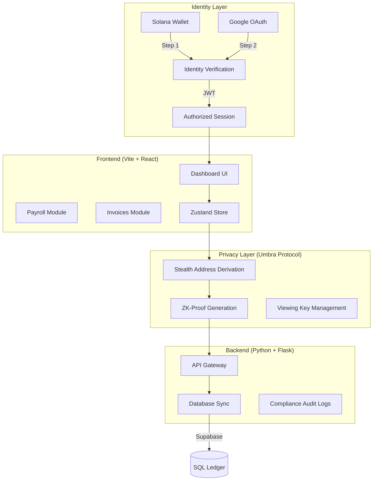
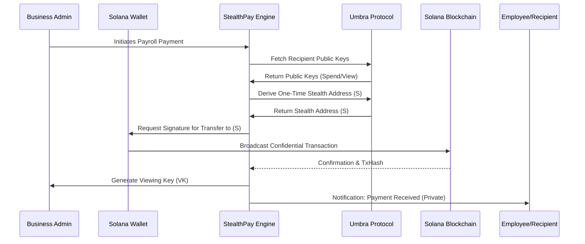

# StealthPay: Private Business Finance OS

StealthPay is a production-grade financial operating system designed for businesses that require absolute privacy on the Solana blockchain. By integrating the **Umbra Protocol SDK**, StealthPay ensures that sensitive financial activities—such as payroll, invoicing, and vendor payments—are completely confidential by default, while remaining legally compliant through selective disclosure.

---

## 🏗️ System  Architecture

StealthPay utilizes a high-performance full-stack architecture with a specialized privacy layer.

---

## 🔐 Privacy & Security Model

StealthPay operates on a "Zero-Knowledge Visibility" principle for external observers while maintaining a "Verified Identity" principle for internal operations.

### Transaction Lifecycle Flow

---

## 🌟 Core Concepts

### 1. Privacy-as-a-Service (PaaS)
On a public ledger like Solana, every transaction is visible. StealthPay solves this by using **Stealth Addresses**. For every payment, a unique, one-time address is derived from the recipient's public key. Only the recipient (and authorized auditors) can link this address back to their main identity.

### 2. Multi-Factor Identity (MFI)
Unlike traditional web3 apps that only use a wallet, StealthPay mandates a **Two-Step Authentication** flow:
- **Cryptographic Identity**: Verified via Solana Wallet signature.
- **Organizational Identity**: Verified via Google Workspace OAuth.
This ensures that corporate financial tools are only accessible to authorized personnel.

### 3. Selective Disclosure (Compliance)
StealthPay balances privacy with regulatory requirements. Every transaction generates a **Viewing Key**. This key allows the holder to decrypt and view transaction details without exposing the user's entire history or private keys.

---

## 📊 Feature Comparison

| Feature | Standard Wallet | StealthPay OS |
| :--- | :---: | :---: |
| **Transaction Visibility** | Public (Explorer) | Encrypted (Stealth) |
| **Identity Linkage** | Wallet Address | Multi-Factor (Google + Wallet) |
| **Payroll Privacy** | None (All salaries public) | Absolute (Private Transfers) |
| **Invoicing** | Manual Tracking | Automated & Encrypted |
| **Auditability** | Full Public Exposure | Selective via Viewing Keys |
| **Compliance** | Hard to track | Native Decryption Terminal |

---

## 🛠️ Implementation Structure

### **Directory Map**
- `frontend/src/lib/umbra.ts`: Core privacy logic for stealth address generation.
- `frontend/src/store/index.ts`: Centralized state management for all modules.
- `frontend/src/pages/AuthPage.tsx`: High-security 2-step verification entry.
- `frontend/src/pages/CompliancePage.tsx`: Selective disclosure and decryption terminal.
- `backend/app.py`: Scalable API gateway for database synchronization.

---

## 🚀 Future Roadmap

- [ ] **AI-Powered Compliance Audit**: Automatic flagging of suspicious private transfers.
- [ ] **Multi-Chain Privacy**: Extending stealth payments to Ethereum and Polygon.
- [ ] **Fiat On/Off Ramp**: Private integration with Circle (USDC) for direct bank transfers.
- [ ] **Hardware Wallet Support**: Ledger/Trezor integration for corporate treasury.

---

## 📡 Current Network Status

The application is currently configured for **Solana Devnet**.

- **Network**: `devnet`
- **RPC Endpoint**: `https://api.devnet.solana.com`
- **Privacy Standard**: Umbra v4 Stealth Protocol
- **MFA Status**: Enabled (Mandatory)

---

## 🛠️ Tech Stack

- **UI**: React 18, Tailwind CSS, Framer Motion, Lucide Icons.
- **Web3**: @solana/web3.js, @umbra-privacy/sdk.
- **Auth**: Firebase (Google OAuth), Solana Wallet Standard.
- **State**: Zustand (with Persist middleware).
- **Backend**: Flask (Python), Supabase (PostgreSQL).

---

© 2026 StealthPay - Private Business Finance OS
