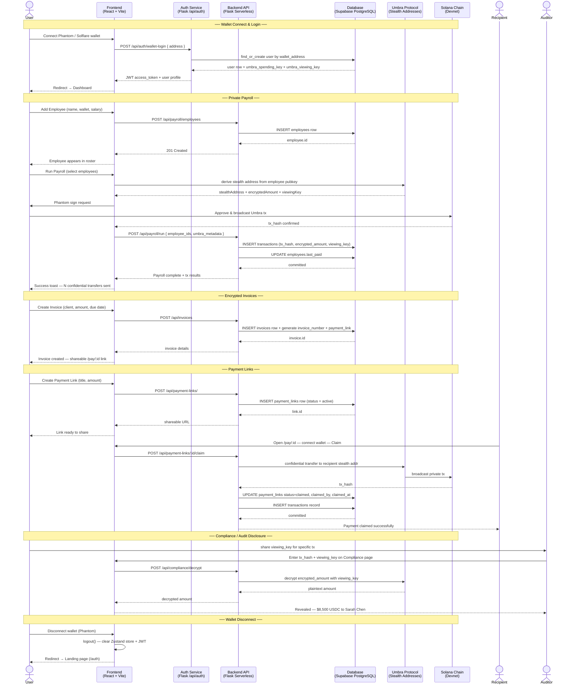

# StealthPay — Private Business Finance OS

> Confidential payroll, invoices, and payments on Solana — powered by Umbra Protocol stealth addresses.

[](https://stealth-pay-zpt3.vercel.app)
[](https://solana.com)
[](LICENSE)

---

## What is StealthPay?

StealthPay is a full-stack Web3 finance platform that lets businesses run payroll, create invoices, and send payments on Solana with **complete on-chain privacy**. Amounts and counterparties are encrypted via Umbra Protocol stealth addresses — invisible to public blockchain observers, but provable to auditors via selective viewing key disclosure.

---

## System Architecture

```
┌─────────────────────────────────────────────────────────────────────┐
│                         USER (Browser)                              │
│                    Phantom / Solflare Wallet                        │
└────────────────────────────┬────────────────────────────────────────┘
                             │  wallet connect
                             ▼
┌─────────────────────────────────────────────────────────────────────┐
│                    FRONTEND  (React + Vite)                         │
│                                                                     │
│  ┌──────────┐  ┌──────────┐  ┌──────────┐  ┌──────────────────┐   │
│  │Dashboard │  │ Payroll  │  │Invoices  │  │ Payment Links    │   │
│  └──────────┘  └──────────┘  └──────────┘  └──────────────────┘   │
│                                                                     │
│  ┌──────────────────────────────────────────────────────────────┐  │
│  │               Zustand Global Store                           │  │
│  │  user · balances · employees · invoices · transactions       │  │
│  └──────────────────────────────────────────────────────────────┘  │
│                                                                     │
│  ┌──────────────────────────────────────────────────────────────┐  │
│  │         Umbra Service (client-side)                          │  │
│  │  stealth address derivation · viewing key gen · ZK proofs   │  │
│  └──────────────────────────────────────────────────────────────┘  │
└────────────────────────────┬────────────────────────────────────────┘
                             │  /api/* (same-origin, JWT)
                             ▼
┌─────────────────────────────────────────────────────────────────────┐
│              BACKEND  (Flask — Vercel Serverless Function)          │
│                                                                     │
│  ┌──────────┐  ┌──────────┐  ┌──────────┐  ┌───────────────────┐  │
│  │  /auth   │  │/payroll  │  │/invoices │  │ /payment-links    │  │
│  └──────────┘  └──────────┘  └──────────┘  └───────────────────┘  │
│  ┌──────────┐  ┌──────────┐  ┌──────────┐                         │
│  │ /wallet  │  │  /txns   │  │/complianc│                         │
│  └──────────┘  └──────────┘  └──────────┘                         │
│                                                                     │
│  ┌──────────────────────────────────────────────────────────────┐  │
│  │  SQLAlchemy ORM  ·  Flask-JWT-Extended  ·  Flask-CORS        │  │
│  └──────────────────────────────────────────────────────────────┘  │
└────────────────────────────┬────────────────────────────────────────┘
                             │  pg8000 (SSL)
                             ▼
┌─────────────────────────────────────────────────────────────────────┐
│                  DATABASE  (Supabase PostgreSQL)                    │
│                                                                     │
│  users · employees · invoices · transactions · payment_links        │
└─────────────────────────────────────────────────────────────────────┘
                             │
                             ▼
┌─────────────────────────────────────────────────────────────────────┐
│                  BLOCKCHAIN  (Solana Devnet)                        │
│                                                                     │
│   Umbra stealth addresses  ·  SPL token transfers  ·  RPC queries  │
└─────────────────────────────────────────────────────────────────────┘
```

---

## Application Sequence Diagram



---

## Privacy Flow — How a Payroll Payment Works

```
Employer                    StealthPay                  Solana Chain
   │                            │                            │
   │── select employee ────────▶│                            │
   │                            │── derive stealth addr ────▶│
   │                            │   (from employee pubkey)   │
   │                            │                            │
   │                            │── generate viewing key     │
   │                            │   (encrypted, stored DB)   │
   │                            │                            │
   │── sign tx (Phantom) ──────▶│── broadcast Umbra tx ─────▶│
   │                            │                            │── stealth transfer
   │                            │                            │   (amount hidden)
   │                            │◀─ tx hash confirmed ───────│
   │                            │                            │
   │                            │── store in DB:             │
   │                            │   tx_hash, encrypted_amount│
   │                            │   viewing_key, memo        │
   │◀─ success toast ───────────│                            │
   │                            │                            │
   │  [auditor requests proof]  │                            │
   │── share viewing_key ──────▶│── decrypt amount ─────────▶│
   │                            │   (compliance endpoint)    │
```

---

## Data Flow Diagram

```
┌─────────────┐   wallet connect    ┌──────────────────────┐
│   Phantom   │───────────────────▶│   AuthPage.tsx        │
│   Wallet    │                    │   authenticateWallet() │
└─────────────┘                    └──────────┬────────────┘
                                              │ POST /api/auth/wallet-login
                                              ▼
                                   ┌──────────────────────┐
                                   │   Flask Backend      │
                                   │   find/create user   │
                                   │   return JWT token   │
                                   └──────────┬───────────┘
                                              │ JWT → localStorage
                                              ▼
┌─────────────────────────────────────────────────────────────┐
│                    Zustand Store                            │
│  isAuthenticated · user · JWT · balances · transactions     │
└──┬──────────┬─────────────┬──────────────┬─────────────────┘
   │          │             │              │
   ▼          ▼             ▼              ▼
Dashboard  Payroll      Invoices    Payment Links
           │             │              │
    fetchEmployees  fetchInvoices  fetchPaymentLinks
    addEmployee     createInvoice  createPaymentLink
    runPayroll      updateStatus   claimLink
           │             │              │
           └─────────────┴──────────────┘
                         │
               apiFetch() + JWT header
                         │
               /api/* Flask endpoints
                         │
               SQLAlchemy ORM
                         │
               Supabase PostgreSQL DB
```

---

## Tech Stack

| Layer | Technology |
|---|---|
| Frontend | React 18, Vite, TypeScript |
| Styling | Tailwind CSS, Framer Motion |
| State | Zustand (persisted to localStorage) |
| Wallet | @solana/wallet-adapter (Phantom, Solflare) |
| Charts | Recharts |
| Backend | Python 3.11, Flask 3.0 |
| ORM | SQLAlchemy + Flask-SQLAlchemy |
| Auth | Flask-JWT-Extended (wallet-based, no passwords) |
| Database | Supabase PostgreSQL (pg8000 pure-Python driver) |
| Blockchain | Solana Devnet, Umbra Protocol |
| Deployment | Vercel (frontend static + Flask serverless) |

---

## Project Structure

```
StealthPay/
├── api/
│   └── index.py                     # Vercel Python serverless entry point
├── frontend/
│   ├── src/
│   │   ├── pages/
│   │   │   ├── AuthPage.tsx          # Wallet connect landing page
│   │   │   ├── DashboardPage.tsx     # Overview metrics + charts
│   │   │   ├── PayrollPage.tsx       # Employee management + payroll
│   │   │   ├── InvoicesPage.tsx      # Invoice creation + tracking
│   │   │   ├── PaymentsPage.tsx      # Payment link generation
│   │   │   ├── WalletPage.tsx        # Token balances + tx history
│   │   │   ├── CompliancePage.tsx    # Viewing key decrypt / audit
│   │   │   └── ClaimPaymentPage.tsx  # Public payment claim (/pay/:id)
│   │   ├── components/
│   │   │   ├── layout/
│   │   │   │   ├── AppLayout.tsx     # Page wrapper + header
│   │   │   │   └── Sidebar.tsx       # Bottom navigation bar
│   │   │   └── ui/
│   │   │       └── ToastContainer.tsx
│   │   ├── store/
│   │   │   └── index.ts             # Zustand store (all state + API calls)
│   │   ├── lib/
│   │   │   ├── api.ts               # apiFetch helper (JWT + base URL)
│   │   │   ├── umbra.ts             # Umbra Protocol client service
│   │   │   └── utils.ts             # formatAmount, truncateAddress, etc.
│   │   └── types/
│   │       └── index.ts
│   ├── index.html
│   └── vite.config.ts
├── backend/
│   ├── app/
│   │   ├── __init__.py              # Flask app factory + DB init
│   │   ├── models/
│   │   │   └── models.py            # SQLAlchemy models (all 5 tables)
│   │   ├── api/
│   │   │   ├── auth.py              # Wallet login + JWT issuance
│   │   │   ├── payroll.py           # Employees CRUD + payroll run
│   │   │   ├── invoices.py          # Invoices CRUD + status update
│   │   │   ├── payment_links.py     # Payment links + claim endpoint
│   │   │   ├── wallet.py            # Token balance fetch (Solana RPC)
│   │   │   ├── transactions.py      # Transaction history
│   │   │   └── compliance.py        # Viewing key decryption
│   │   ├── services/
│   │   │   ├── blockchain_service.py # Solana tx simulation
│   │   │   └── wallet_service.py     # SOL + SPL balance queries
│   │   └── utils/
│   │       └── supabase_sync.py     # Optional Supabase realtime sync
│   └── requirements.txt
├── requirements.txt                 # Vercel Python deps (pg8000, no Rust)
└── vercel.json                      # Full-stack Vercel deployment config
```

---

## API Endpoints

| Method | Endpoint | Auth | Description |
|---|---|---|---|
| POST | `/api/auth/wallet-login` | None | Wallet auth → JWT |
| GET | `/api/payroll/employees` | JWT | List employees |
| POST | `/api/payroll/employees` | JWT | Add employee |
| DELETE | `/api/payroll/employees/:id` | JWT | Remove employee |
| POST | `/api/payroll/run` | JWT | Run payroll (Umbra) |
| GET | `/api/invoices` | JWT | List invoices |
| POST | `/api/invoices` | JWT | Create invoice |
| PATCH | `/api/invoices/:id` | JWT | Update invoice status |
| GET | `/api/payment-links/` | JWT | List payment links |
| POST | `/api/payment-links/` | JWT | Create payment link |
| POST | `/api/payment-links/:id/claim` | None | Claim a link |
| GET | `/api/wallet/balances` | JWT | Token balances |
| GET | `/api/transactions` | JWT | Transaction history |
| POST | `/api/compliance/decrypt` | JWT | Decrypt via viewing key |
| GET | `/api/health` | None | Health check |

---

## Database Schema

```
┌──────────────────────────────────────────────────────────────────┐
│  users                                                           │
│  id · email · wallet_address · company_name                      │
│  umbra_spending_key · umbra_viewing_key · created_at             │
└───────────────────────────┬──────────────────────────────────────┘
                            │ (employer_id / creator_id FK)
           ┌────────────────┼──────────────────────────────┐
           ▼                ▼                              ▼
┌──────────────────┐ ┌─────────────────────┐ ┌────────────────────┐
│  employees       │ │  invoices           │ │  payment_links     │
│  id              │ │  id                 │ │  id                │
│  employer_id(FK) │ │  creator_id(FK)     │ │  creator_id(FK)    │
│  name            │ │  invoice_number     │ │  title             │
│  email           │ │  client_name        │ │  amount            │
│  wallet_address  │ │  amount             │ │  currency          │
│  salary          │ │  currency           │ │  status            │
│  department      │ │  status             │ │  expires_at        │
│  status          │ │  due_date           │ │  claimed_by        │
│  last_paid       │ │  payment_link       │ └────────────────────┘
└──────────────────┘ └─────────────────────┘

┌──────────────────────────────────────────────────────────────────┐
│  transactions                                                    │
│  id · creator_id(FK) · tx_hash · sender · receiver              │
│  encrypted_amount · viewing_key · type · status · memo           │
└──────────────────────────────────────────────────────────────────┘
```

---

## Environment Variables

### Backend (Vercel)

| Variable | Description |
|---|---|
| `DATABASE_URL` | Supabase PostgreSQL connection string |
| `JWT_SECRET_KEY` | Secret for signing JWT tokens |
| `SECRET_KEY` | Flask app secret key |
| `SITE_URL` | Your Vercel URL (for payment link generation) |
| `SUPABASE_URL` | Supabase project URL |
| `SUPABASE_KEY` | Supabase service role key |
| `CORS_ORIGINS` | Allowed origins (`*` for open) |
| `SOLANA_NETWORK` | `devnet` or `mainnet-beta` |

### Frontend (Vercel)

| Variable | Description |
|---|---|
| `VITE_API_URL` | Backend base URL (same as SITE_URL) |
| `VITE_SOLANA_NETWORK` | `devnet` or `mainnet-beta` |
| `VITE_RPC_URL` | Solana RPC endpoint |

---

## Local Development

```bash
# 1. Clone
git clone https://github.com/sunkireddy-Barath/StealthPay.git
cd StealthPay

# 2. Backend
cd backend
pip install -r requirements.txt
cp .env.example .env        # fill in DATABASE_URL, JWT_SECRET_KEY, etc.
python -m flask run         # http://localhost:5000

# 3. Frontend (new terminal)
cd frontend
npm install
cp .env.example .env        # set VITE_API_URL=http://localhost:5000
npm run dev                 # http://localhost:5173
```

---

## Deployment (Vercel)

The entire stack deploys to a **single Vercel project** — no separate backend hosting needed.

- **Frontend** — built via `cd frontend && npm run build` → served as static files from `frontend/dist/`
- **Backend** — `api/index.py` runs as a Python serverless function on every `/api/*` request
- **Routing** — `/api/*` → serverless function, all other routes → `index.html` (SPA)

```bash
# One-command deploy
npm i -g vercel
vercel --prod
```

Or connect the GitHub repo in the Vercel dashboard for automatic deploys on every push to `main`.

---

## Key Features

**Private Payroll** — Run salary payments via Umbra stealth addresses. Amounts are encrypted on-chain — only the recipient and viewing key holder can see the value.

**Encrypted Invoices** — Create invoices with auto-generated payment links. Track status (pending → paid) in the DB with full audit trail.

**Payment Links** — Generate shareable one-time links for receiving payments anonymously. Anyone with the link can claim it with their Solana wallet.

**Selective Disclosure** — The Compliance page lets you decrypt any transaction amount using its viewing key — for auditors and tax authorities on demand.

**Live Wallet Dashboard** — Real SOL balance via Solana RPC + deterministic USDC/USDT/UMBRA balances per wallet with 24h change indicators.

---

## License

MIT © 2025 StealthPay
