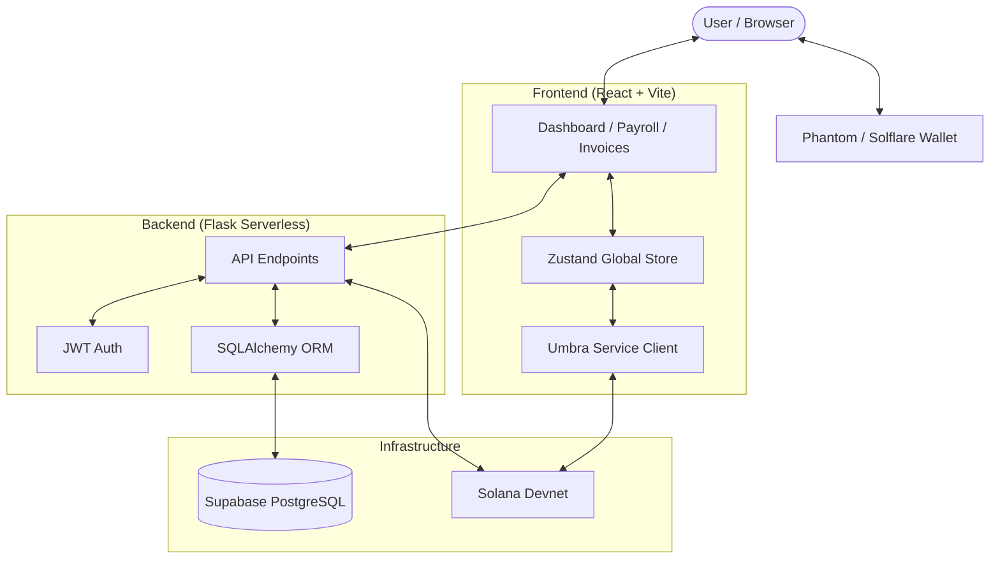
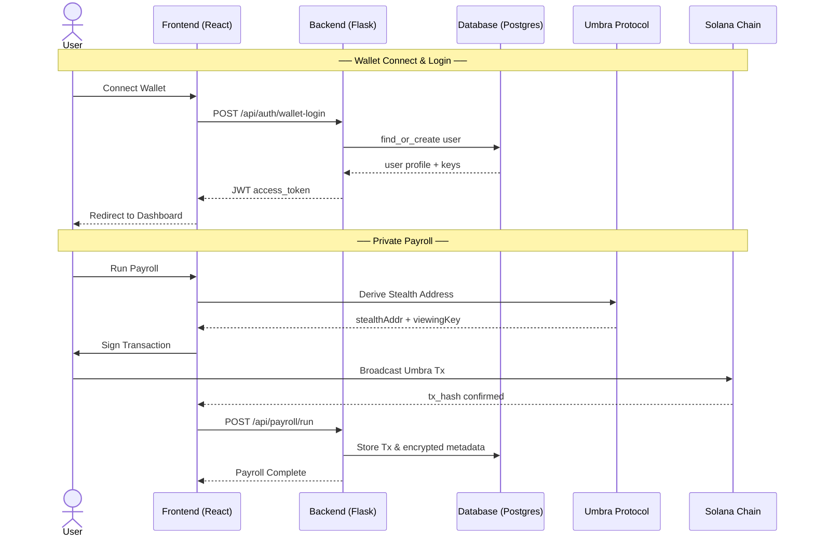
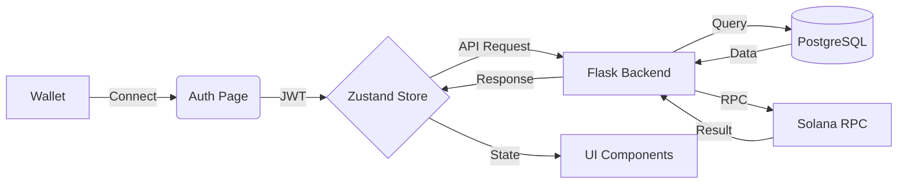
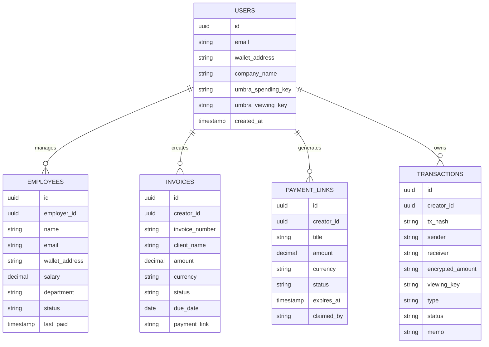

# StealthPay — Private Business Finance OS

> Confidential payroll, invoices, and payments on Solana — powered by Umbra Protocol stealth addresses.

[](https://stealth-pay-zpt3.vercel.app)
[](https://solana.com)
[](LICENSE)

---

## 🌟 What is StealthPay?

StealthPay is a full-stack Web3 finance platform that enables businesses to run payroll, create invoices, and send payments on Solana with **complete on-chain privacy**. Amounts and counterparties are encrypted via Umbra Protocol stealth addresses — invisible to public blockchain observers, but provable to auditors via selective viewing key disclosure.

---

## ✨ Key Features

-   🏦 **Private Payroll**: Run salary payments via Umbra stealth addresses. Amounts are encrypted on-chain.
-   📄 **Encrypted Invoices**: Create invoices with auto-generated payment links and track status securely.
-   🔗 **Payment Links**: Generate shareable one-time links for receiving payments anonymously.
-   🔍 **Selective Disclosure**: Reveal transaction details to auditors on-demand using private viewing keys.
-   📊 **Live Dashboard**: Real-time SOL/SPL balances, transaction history, and financial metrics.

---

## 🏗️ System Architecture



---

## 🔄 Application Sequence Diagram



---

## 📊 Data Flow



---

## 🗄️ Database Schema



---

## 🛠️ Tech Stack

| Layer          | Technology                                   |
| :------------- | :------------------------------------------- |
| **Frontend**   | React 18, Vite, TypeScript                   |
| **Styling**    | Tailwind CSS, Framer Motion, Radix UI        |
| **State**      | Zustand (Persisted)                          |
| **Wallet**     | @solana/wallet-adapter                       |
| **Backend**    | Python 3.11, Flask 3.0                       |
| **ORM**        | SQLAlchemy + Flask-SQLAlchemy                |
| **Auth**       | Flask-JWT-Extended                           |
| **Database**   | Supabase PostgreSQL (pg8000)                 |
| **Blockchain** | Solana Devnet, Umbra Protocol                |
| **Deployment** | Vercel (Frontend + Serverless Functions)     |

---

## 📂 Project Structure

```text
StealthPay/
├── api/                     # Vercel Python serverless entry point
├── backend/                 # Flask backend logic
│   ├── app/
│   │   ├── api/             # API route handlers
│   │   ├── models/          # SQLAlchemy models
│   │   ├── services/        # Blockchain & wallet logic
│   │   └── utils/           # Utility functions
├── frontend/                # React application
│   ├── src/
│   │   ├── pages/           # Page components
│   │   ├── components/      # Reusable UI components
│   │   ├── store/           # Zustand state management
│   │   └── lib/             # API & Umbra service logic
├── vercel.json              # Vercel deployment configuration
└── requirements.txt         # Root dependencies for Vercel
```

---

## 🔌 API Endpoints

| Method | Endpoint                        | Auth | Description                   |
| :----- | :------------------------------ | :--- | :---------------------------- |
| `POST` | `/api/auth/wallet-login`        | No   | Wallet auth → JWT             |
| `GET`  | `/api/payroll/employees`        | Yes  | List employees                |
| `POST` | `/api/payroll/run`              | Yes  | Run payroll (Umbra)           |
| `GET`  | `/api/invoices`                 | Yes  | List invoices                 |
| `POST` | `/api/invoices`                 | Yes  | Create invoice                |
| `POST` | `/api/payment-links/:id/claim`  | No   | Claim a payment link          |
| `POST` | `/api/compliance/decrypt`       | Yes  | Decrypt via viewing key       |
| `GET`  | `/api/health`                   | No   | Health check                  |

---

## ⚙️ Environment Variables

### Backend
| Variable           | Description                                  |
| :----------------- | :------------------------------------------- |
| `DATABASE_URL`     | Supabase PostgreSQL connection string        |
| `JWT_SECRET_KEY`   | Secret for signing JWT tokens                |
| `SOLANA_NETWORK`   | `devnet` or `mainnet-beta`                   |
| `SUPABASE_KEY`     | Supabase service role key                    |

### Frontend
| Variable              | Description                               |
| :-------------------- | :---------------------------------------- |
| `VITE_API_URL`        | Backend base URL                          |
| `VITE_SOLANA_NETWORK` | `devnet` or `mainnet-beta`                |
| `VITE_RPC_URL`        | Solana RPC endpoint                       |

---

## 🚀 Local Development

```bash
# 1. Clone the repository
git clone https://github.com/sunkireddy-Barath/StealthPay.git
cd StealthPay

# 2. Setup Backend
cd backend
python -m venv venv
source venv/bin/activate  # On Windows: venv\Scripts\activate
pip install -r requirements.txt
cp .env.example .env      # Configure your environment
python run.py

# 3. Setup Frontend (New Terminal)
cd frontend
npm install
cp .env.example .env      # Set VITE_API_URL=http://localhost:5000
npm run dev
```

---

## 📦 Deployment (Vercel)

The entire stack deploys to a **single Vercel project**.

1.  Push your code to GitHub.
2.  Connect the repository in the Vercel Dashboard.
3.  Configure Environment Variables.
4.  Vercel will automatically detect the Python `api/` directory and React `frontend/` directory.

```bash
# Optional: Manual deploy
vercel --prod
```

---

## 🔒 Privacy & Compliance

StealthPay uses **Umbra Protocol** to ensure that transaction amounts and recipients are not visible on public explorers. 

-   **Spending Keys**: Used only by the recipient to withdraw funds.
-   **Viewing Keys**: Can be shared with auditors to decrypt specific transaction amounts, ensuring regulatory compliance while maintaining day-to-day privacy.

---

## 📄 License

MIT © 2025 StealthPay
